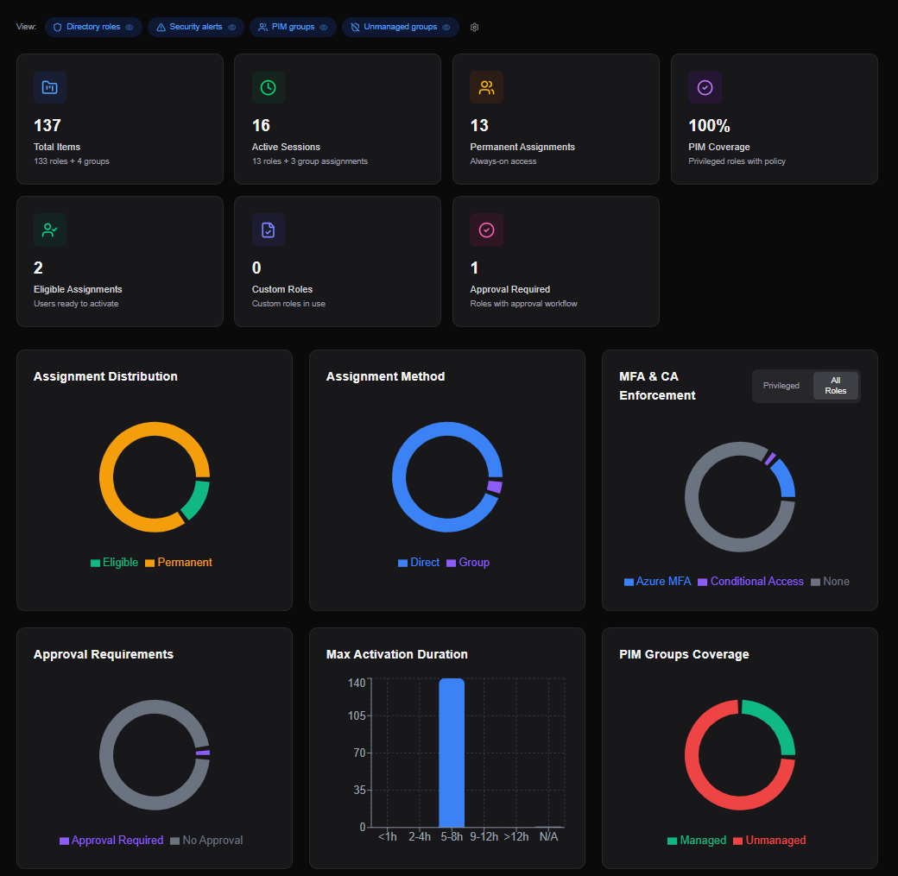

  
  <h1>PIM Manager</h1>
  
<strong>Privileged Identity Management Manager & Visualizer</strong>

  
  
  
  
  

  

    <a href="#about">About</a> •
    <a href="#key-benefits">Key Benefits</a> •
    <a href="docs/en/README.md">Documentation</a> •
    <a href="#transparency">Transparency</a>
  

---

## About

**PIM Manager** is a specialized tool designed to simplify, visualize, and manage Microsoft Entra ID Privileged Identity Management (PIM) assignments and configurations.

### Why PIM Manager?

Managing Privileged Access in complex environments is challenging.

**Functional Benefits**:
*   **Visual Clarity**: See who has access to what, instantly.
*   **Governance Focused**: Built for admins who need to prove compliance and control.

**Architectural Philosophy**:
*   **Client-Side Architecture**: PIM Manager runs entirely in your browser. No data is stored on our servers. Your tokens and data stay within your session.
*   **Direct Graph API Integration**: We leverage the official Microsoft Graph API for all operations, ensuring reliability and security.
*   **Governance First**: Built for admins who need to prove compliance, offering visualization and reporting capabilities missing from the native tools.
*   **Secure by Design**: Zero Trust principles applied at the core. PIM Manager runs entirely client-side, storing no data on our servers and strictly adhering to the Principle of Least Privilege.

## Key Benefits

*   **Unified Governance**: View and manage all your privileged assignments (Directory Roles and PIM Groups) in a single, consolidated view.
*   **Visual Reporting**: Instantly visualize role distribution and assignment types (Eligible vs. Active) to identify security risks.
*   **Security & Trust**: Open Source and client-side executed for maximum transparency and trust.

## Deployment

PIM Manager can be used in two ways:

### Use the Hosted Version

Visit **[pimmanager.com](https://pimmanager.com)** — no setup required. Sign in with your Microsoft Entra ID account and start immediately.

### Self-Host in Your Own Azure Tenant

Deploy PIM Manager directly into your own Azure environment using Azure Static Web Apps (free tier). No fork or CLI required — everything happens in Azure Portal.

**Prerequisites:**
1. An [App Registration](docs/en/README.md) in your Microsoft Entra ID tenant with the required permissions
2. An Azure subscription

**Deploy:**

The wizard asks for 3 values:
- **Static Web App Name** — the resource name in Azure
- **Location** — Azure region (West Europe recommended)
- **Entra Client ID** — the Client ID from your App Registration

Azure will create the Static Web App, automatically download the latest release, and deploy it. Your app will be live at the URL shown in the deployment outputs.

**After deployment:** add your Static Web App URL as a redirect URI in your App Registration:
1. Go to **Entra ID > App registrations > [Your App] > Authentication**
2. Under **Single-page application**, add your SWA URL (e.g. `https://your-app.azurestaticapps.net`)
3. Save

> The app will not function until this step is completed. See [Deployment docs](docs/en/10-deployment.md) for full details.

**To update:** re-run the template or delete and redeploy.

---

## What's New

See [**CHANGELOG.md**](CHANGELOG.md) for the latest features, improvements, and security updates.

## Documentation

Comprehensive documentation is available in the [`docs/`](docs/) directory.

*   [**Architecture**](docs/en/00-architecture.md) - Deep dive into the client-side design.
*   [**Data Flow**](docs/en/03-data-flow.md) - How we fetch and process Graph data.
*   [**Security Model**](docs/en/05-security.md) - Authentication, authorization, and data protection.
*   [**Key Concepts**](docs/en/06-key-concepts.md) - PIM terminology and technical concepts.

## Transparency

PIM Manager's architecture, security model, and zero-trust principles were designed by [Joël Prins](https://www.linkedin.com/in/joelprins/).
Generative AI was used to assist in the coding and research of this project. Every file, function, and logic block has been verified, sanitized, and approved by a human engineer to ensure security and reliability.

For details on how we process data, see [Data Flow](docs/en/03-data-flow.md).

## License

This project is licensed under the **GNU General Public License v3.0**.
See the [LICENSE](LICENSE) file for details.

---

  <h3>Visitor Statistics</h3>
  
<strong>Page Views:</strong>

  
   
   
  
<strong>Self-Hosted Deployments:</strong>

  
   
   
  
<strong>Unique Visitors:</strong>

  

