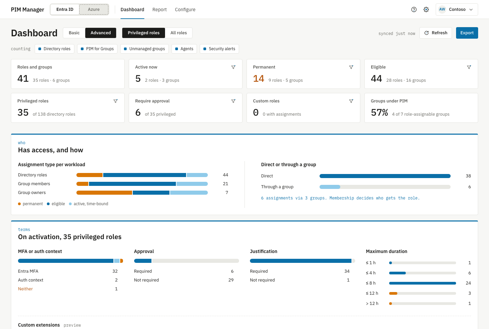

<div align="center">
  
  <h1>PIM Manager</h1>
  <p><strong>See who can become what in your Entra ID tenant, and change it safely.</strong></p>

  [](LICENSE)
  [](https://nextjs.org)
  [](https://www.typescriptlang.org/)
  [](https://entra.microsoft.com)
  [](https://tailwindcss.com/)

  <p>
    <a href="https://pimmanager.com">pimmanager.com</a> •
    <a href="https://pimmanager.com/demo">Live demo</a> •
    <a href="docs/en/README.md">Documentation</a> •
    <a href="#transparency">Transparency</a>
  </p>
</div>

---

## About

Privileged Identity Management is where your tenant decides who can become Global Administrator, for how long, and with which checks. The Entra portal shows that one role at a time. PIM Manager shows all of it at once, and lets you change it in bulk without guessing.

It reads your PIM setup through Microsoft Graph, straight from your browser. No backend. No agent. Just your browser and Graph.

<picture>
  <source media="(prefers-color-scheme: dark)" srcset="public/previews/dashboard-advanced-dark.png" />
  
</picture>

## What it does

- **Dashboard**: the numbers an admin actually asks about. Who has permanent access, who is eligible, which privileged roles you can activate without MFA, role-assignable groups outside PIM, and Microsoft's own PIM alerts. Basic for the overview, Advanced for the detail. Click a number and it filters.
- **Report**: every directory role and PIM group, with its assignments and its policy, side by side. Filters live in the URL, so a link shows a colleague exactly what you see. Export to CSV for people, to an import file for Configure, or to a JSON backup with every policy.
- **Configure**: change settings and assignments for one role, or the same rules for fifty. Edit them directly, follow the Guided route, import a file, or start from the PIM Monitor access model. Nothing is written until you review it. The review runs the checks and a validation-only dry run, the apply saves a snapshot first, and the last ten applies can be undone.

It covers directory roles and PIM for Groups. AI agents with a role (Microsoft Entra Agent ID) are counted separately, so they do not hide between your admins. Azure resource roles are not in yet.

## Try it

**Live demo.** Open [pimmanager.com/demo](https://pimmanager.com/demo) and you get the whole app on Contoso, a made-up tenant. No sign-in, nothing is read from or sent to Microsoft, and applying changes is switched off.

**Hosted version.** Sign in at [pimmanager.com](https://pimmanager.com) with your Microsoft Entra ID account. An admin consents once per tenant. The app only reads until you open Configure.

## Self-host in your own Azure tenant

Prefer to run it yourself? Deploy it to Azure Static Web Apps (free tier) from the Azure Portal. No fork needed.

**Prerequisites:**
1. An [App Registration](docs/en/01-introduction.md#microsoft-entra-app-registration) in your Microsoft Entra ID tenant with the required permissions.
2. An Azure subscription with the `Microsoft.Storage` and `Microsoft.ContainerInstance` resource providers registered. The template publishes the app with a one-time deployment script in an Azure Container Instance, so both providers must be there first. If they are not, register them and wait until they finish:
   ```bash
   az provider register --namespace Microsoft.Storage --wait
   az provider register --namespace Microsoft.ContainerInstance --wait
   ```

**Deploy:**

[](https://portal.azure.com/#create/Microsoft.Template/uri/https%3A%2F%2Fraw.githubusercontent.com%2F0125joel%2FPIM-Manager%2Fmain%2Fazuredeploy.json)

The template asks for three values:
- **Static Web App Name**: the resource name in Azure
- **Location**: the Azure region (West Europe is the default)
- **Entra Client ID**: the Client ID of your App Registration

Azure creates the Static Web App, downloads the latest release and deploys it. The URL of your app is in the deployment outputs.

**After deployment**, add that URL as a redirect URI to your App Registration:
1. Go to **Entra ID > App registrations > [Your App] > Authentication**
2. Under **Single-page application**, add your Static Web App URL followed by `/redirect` (e.g. `https://your-app.azurestaticapps.net/redirect`)
3. Save

> Sign-in does not work until this step is done. See the [deployment docs](docs/en/10-deployment.md) for the details and the known Azure registration hiccups.

**To update**, run the template again: it always takes the latest release. A self-hosted install tells you when a newer version is out.

---

## How it handles your data

- **Client-side only.** Every Graph call runs in your browser with your own token. Tenant data never touches a server of ours, because there is none.
- **Least privilege.** Sign-in asks for read permissions only. Write permissions are asked for when you choose Grant permission in Configure, per workload, never at sign-in.
- **Strict Content Security Policy.** No inline scripts or styles, apart from the hashed hydration scripts. Besides Microsoft's sign-in and Graph, the app only talks to pimmonitor.com for the access model catalog, GitHub for the update check and, on the hosted version, Cloudflare Web Analytics. None of them get tenant data.

## What's new

See [CHANGELOG.md](CHANGELOG.md) for features, fixes and security updates.

## Documentation

The full documentation lives in [`docs/`](docs/).

- [Architecture](docs/en/00-architecture.md): how the client-side design fits together.
- [Data flow](docs/en/03-data-flow.md): how Graph data is fetched and processed.
- [Security model](docs/en/05-security.md): authentication, authorization and data protection.
- [Key concepts](docs/en/06-key-concepts.md): PIM terminology in plain words.
- [Deployment](docs/en/10-deployment.md): hosted and self-hosted setup.

## Transparency

PIM Manager's architecture, security model and zero-trust principles were designed by [Joël Prins](https://www.linkedin.com/in/joelprins/).
Generative AI helped with the coding and research of this project. Every file, function and logic block has been reviewed and approved by a human engineer, because a tool that touches privileged access has to earn its trust.

For details on how data is processed, see [Data flow](docs/en/03-data-flow.md).

## License

This project is licensed under the **GNU General Public License v3.0**.
See the [LICENSE](LICENSE) file for details.

---

<div align="center">
  <h3>Visitor Statistics</h3>
  <p><strong>Page Views:</strong></p>
  
  <br/>
  <br/>
  <p><strong>Self-Hosted Deployments:</strong></p>
  
  <br/>
  <br/>
  <p><strong>Unique Visitors:</strong></p>
  
</div>
