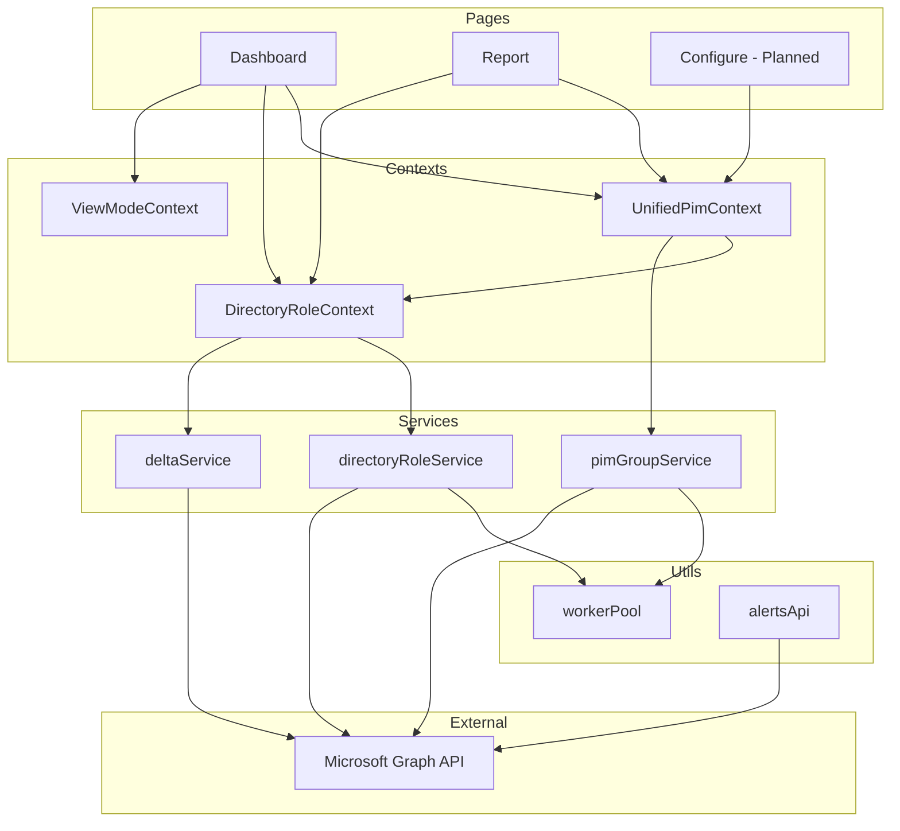

# Folder Structure

This document explains the organization of the PIM Configurator codebase. Understanding this structure helps you navigate the code and find specific functionality.

---

## Root Directory

```
PIM-configurator/
├── docs/                  # Documentation (you are here)
├── public/                # Static assets (icons, images)
├── src/                   # Source code (main application)
├── package.json           # Dependencies and scripts
├── DEPLOYMENT.md          # Deployment instructions
└── README.md              # Project overview
```

---

## Source Code (`/src`)

The `/src` folder contains all application code, organized by purpose:

```
src/
├── app/                   # Pages (Next.js App Router)
├── components/            # Reusable UI components
├── contexts/              # React Context providers
├── services/              # Data fetching logic
├── types/                 # TypeScript type definitions
├── utils/                 # Helper functions
├── config/                # Configuration constants
└── hooks/                 # Custom React hooks
```

---

## Detailed Breakdown

### 📁 `src/app/` - Pages

Each subfolder represents a page in the application.

| Folder | Purpose |
|--------|---------|
| `app/page.tsx` | Landing page (login) |
| `app/dashboard/` | Dashboard overview |
| `app/report/` | Main report page with all role data |
| `app/configure/` | (Coming Soon) Bulk configuration page |
| `app/layout.tsx` | Shared layout (navigation, providers) |
| `app/globals.css` | Global styles |

> [!NOTE]
> Next.js uses **file-based routing**. The folder structure directly maps to URLs:
> - `/app/report/page.tsx` → `https://yourapp.com/report`

---

### 📁 `src/components/` - UI Components

Reusable building blocks used across pages.

| Component | Purpose |
|-----------|---------|
| `Sidebar.tsx` | Side navigation bar |
| `HelpModal.tsx` | Help documentation overlay |
| `LoadingStatus.tsx` | Inline loading indicator for background policy fetch |
| `ScopeBadge.tsx` | Badge showing assignment scope (Tenant-wide, App, RMAU) |
| `RoleFilters.tsx` | Filter UI component for Report page |
| `RoleList.tsx` | List of selectable roles (used in Configure) |
| `RoleSettingsForm.tsx` | Form for PIM settings |
| `ProgressModal.tsx` | Progress indicator for bulk operations |

---

### 📁 `src/contexts/` - Shared State

React Context for sharing data across pages.

| File | Purpose |
|------|---------|
| `PimDataContext.tsx` | **Central data store** for all PIM data |

> [!IMPORTANT]
> `PimDataContext` is the heart of data sharing. It:
> - Fetches data once
> - Caches it in session storage
> - Provides it to all pages
> - Handles background policy loading

---

### 📁 `src/services/` - Data Fetching

Core logic for interacting with Microsoft Graph API.

| File | Purpose |
|------|---------|
| `directoryRoleService.ts` | **Directory Roles**: Fetch role definitions, assignments, policies |
| `pimGroupService.ts` | **PIM Groups**: Fetch PIM-onboarded groups and policies |
| `deltaService.ts` | **Smart Refresh**: Delta queries for incremental updates |
| `pimConfigurationService.ts` | **Write Operations**: Update policies, create assignments (planned) |

**directoryRoleService.ts** contains:
- `getRoleDefinitions()` - Fetch all Entra ID role definitions
- `fetchSinglePolicy()` - Fetch policy for one role
- `concurrentFetchPolicies()` - Parallel policy fetching with worker pool
- `getAllRolesOptimizedWithDeferredPolicies()` - Main data loading with deferred policies

**pimGroupService.ts** contains:
- `fetchAllPimGroupData()` - Fetch all PIM Groups data
- `fetchSingleGroupPolicy()` - Fetch policy for one group
- `concurrentFetchGroupPolicies()` - Parallel group policy fetching
- `syncGroupsWithDelta()` - Delta sync for groups

**deltaService.ts** contains:
- `fetchDirectoryRoleDeltas()` - Incremental updates for roles
- `fetchGroupDeltas()` - Incremental updates for groups
- `getStoredDeltaLink()` / `clearDeltaLink()` - Delta token management

> [!WARNING]
> **Throttling Protection**: Services use worker pools and delays to avoid Graph API throttling (429 errors). Do not remove these safeguards.

---

### 📁 `src/types/` - Type Definitions

TypeScript interfaces describing data structures.

| File | Purpose |
|------|---------|
| `directoryRole.types.ts` | Directory Roles types (RoleDefinition, PimPolicy, etc.) |
| `pimGroup.types.ts` | PIM Groups types (PimGroup, GroupPolicy, etc.) |
| `workload.ts` | Workload system types (WorkloadType, WorkloadData) |
| `roleFilters.ts` | Filter types for role/group filtering |
| `securityAlerts.ts` | Security alerts types |
| `index.ts` | Central exports for easy importing |

**Key types (directoryRole.types.ts):**
- `RoleDefinition` - A Microsoft Entra ID role
- `RoleAssignment` - A permanent assignment
- `PimEligibilitySchedule` - An eligible assignment
- `PimPolicy` - PIM configuration for a role
- `RoleDetailData` - Combined data for one role

**Key types (pimGroup.types.ts):**
- `PimGroup` - A PIM-onboarded group
- `GroupPolicy` - PIM policy for a group (Member or Owner)
- `GroupEligibilitySchedule` - Eligible group membership

---

### 📁 `src/utils/` - Helper Functions

Utility functions and API helpers.

| File | Purpose |
|------|---------|
| `workerPool.ts` | **Worker Pool**: Parallel API calls with concurrency control and throttling protection |
| `logger.ts` | **Centralized Logging**: Development/production logging with environment checks |
| `alertsApi.ts` | **Security Alerts**: Fetch PIM security alerts from Graph API |
| `alertFormatting.ts` | **Alert Formatting**: Format and sort security alerts by severity |
| `chartCapture.ts` | **PDF Generation**: Capture chart elements as images for PDF export |
| `scopeUtils.ts` | **Scope Detection**: Identify scope types (Tenant-wide, App-scoped, RMAU) |
| `authContextApi.ts` | **Authentication Contexts**: Fetch Conditional Access authentication contexts |
| `pimApi.ts` | **[DEPRECATED]** Moved to services/pimConfigurationService |

---

### 📁 `src/config/` - Configuration

Application configuration constants.

| File | Purpose |
|------|---------|
| `authConfig.ts` | Microsoft Entra ID authentication configuration |
| `constants.ts` | Application-wide constants |
| `pdfExportConfig.ts` | **PDF Export configuration** - single source of truth for export sections and stats |
| `locales/en.ts` | **Externalized Text** - Centralized UI strings (Help, Settings, etc.) |

> [!TIP]
> To add a new stat to the PDF export, simply add an entry to the `OVERVIEW_STATS` array in `pdfExportConfig.ts`. It will automatically appear in the export modal and PDF.

> [!CAUTION]
> The `authConfig.ts` file contains your **Microsoft Entra ID client ID**. Ensure this matches your app registration.

---

### 📁 `src/hooks/` - Custom Hooks

Reusable React hooks.

| File | Purpose |
|------|---------|
| `usePimData.ts` | **Legacy wrapper** - re-exports from DirectoryRoleContext for backwards compatibility |
| `useRoleFilters.ts` | **Filter Management**: Role/group filtering logic for Report and Dashboard pages |
| `useAggregatedData.ts` | **Data Aggregation**: Combines data across multiple workloads (Directory Roles, PIM Groups) |
| `useConsentedWorkloads.ts` | **Workload Permissions**: Manages which workloads have user consent |
| `useIncrementalConsent.ts` | **Consent Flow**: Handles incremental permission requests |

### 📁 `src/contexts/` - React Context Providers

Global state management with React Context API.

| File | Purpose |
|------|---------|
| `UnifiedPimContext.tsx` | **Main Orchestrator**: Manages all workloads (Directory Roles, PIM Groups, etc.) with unified refresh logic |
| `DirectoryRoleContext.tsx` | **Directory Roles State**: Manages role data, policies, assignments with delta sync support |
| `ViewModeContext.tsx` | **UI Preferences**: Manages Basic/Advanced view mode toggle with localStorage persistence |
| `MobileMenuContext.tsx` | **Mobile UI State**: Controls mobile menu open/close state |

**Key Context Relationships:**
- `UnifiedPimContext` orchestrates multiple workloads
- `DirectoryRoleContext` provides directory role-specific data
- Dashboard and Report pages consume both contexts
- Delta sync happens transparently through contexts

---

## File Relationships



---

## Next Steps

- [Data Flow](./03-data-flow.md) - See how data moves through these files
- [Graph API Calls](./04-graph-api-calls.md) - Learn which APIs are called
