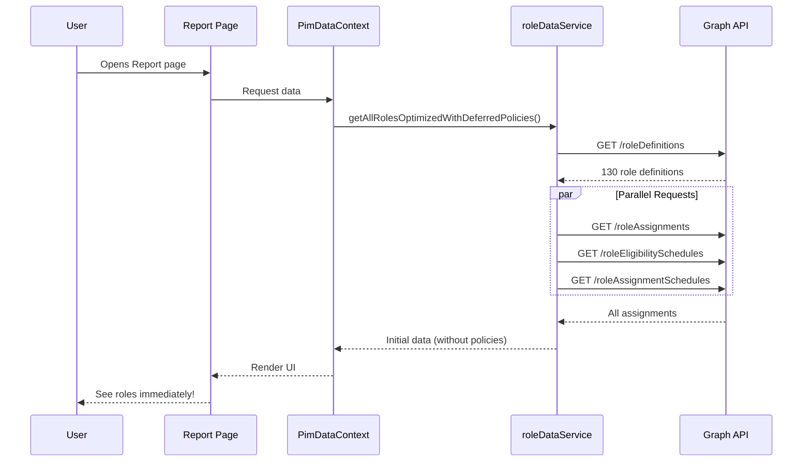
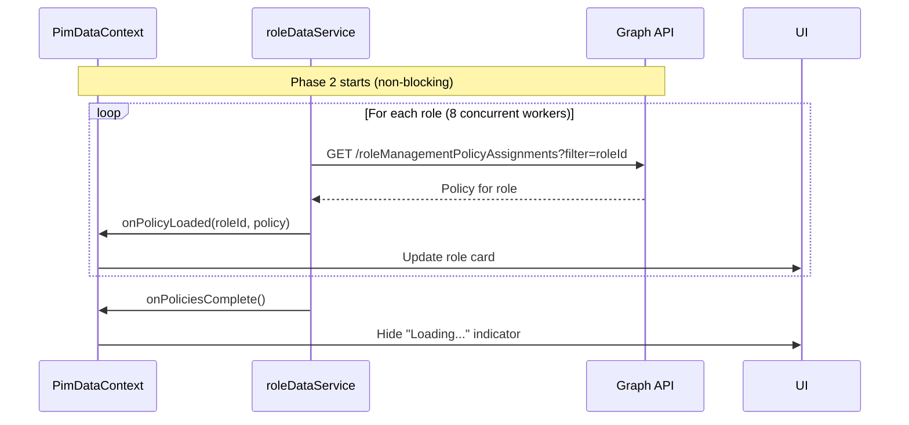
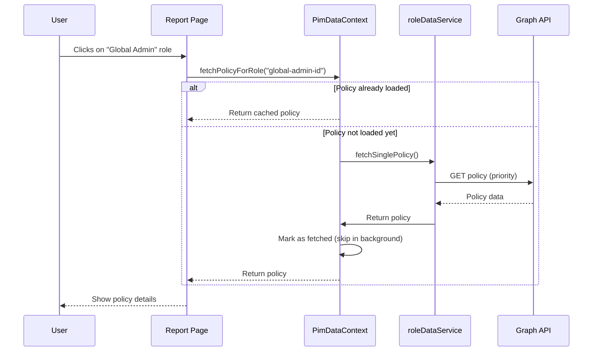
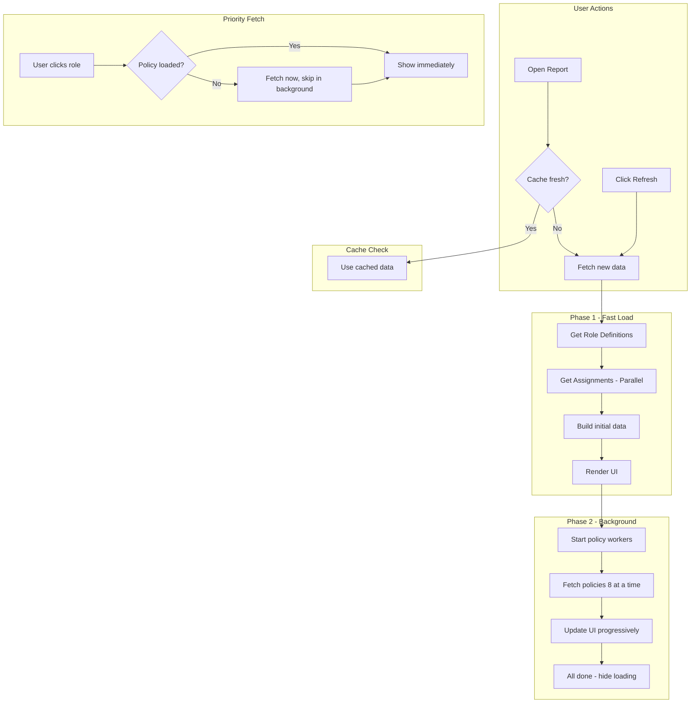

# Data Flow

This document explains how PIM Configurator fetches and processes data. Understanding this flow helps you troubleshoot issues and understand performance characteristics.

---

## Overview

Data loading happens in **two phases** to provide a fast user experience:

| Phase | What Loads | Duration | User Experience |
|-------|------------|----------|-----------------|
| **Phase 1** | Role definitions + assignments | ~10-15 seconds | UI shows immediately |
| **Phase 2** | PIM configurations (policies) | ~2-3 minutes | Loads in background |

> [!TIP]
> The two-phase approach means users can start working with the data almost immediately, while detailed PIM configurations continue loading in the background.

---

## Phase 1: Fast Initial Load



### What Gets Fetched

1. **Role Definitions** (sequential, required first)
   - All Azure AD roles (built-in + custom)
   - ~130 roles in a typical tenant

2. **Assignments** (parallel, faster)
   - Permanent role assignments
   - Eligible assignments (PIM eligibility)
   - Active assignments (currently activated PIM)

> [!NOTE]
> Parallel fetching reduces Phase 1 time by ~3x compared to sequential requests.

---

## Phase 2: Background Policy Loading

After Phase 1 completes, policies load **in the background** while you work:



### Throttling Protection

> [!WARNING]
> Microsoft Graph API has rate limits. Exceeding them causes `429 Too Many Requests` errors.

To avoid throttling, background loading uses:

| Safeguard | Value | Purpose |
|-----------|-------|---------|
| **Concurrent workers** | 8 (optimized) | Maximum parallel requests |
| **Delay between requests** | 300ms (optimized) | Per-worker cooldown |
| **Retry logic** | Built-in | Handles transient failures |
| **Quota usage** | 10-22% | Conservative, safe for all tenant sizes |

This results in ~26 policies loaded per second, completing in **~3-5 seconds for 50 roles** (70-80% faster than the original implementation).

---

## Priority Fetch (On-Demand)

If you click on a role **before** its policy has loaded, the app uses **priority fetching**:



> [!TIP]
> Priority fetch ensures the role you clicked loads immediately, even if background loading hasn't reached it yet.

> Priority fetch ensures the role you clicked loads immediately, even if background loading hasn't reached it yet.

---

## PIM for Groups Strategy

For **PIM for Groups**, a different, optimized strategy is used because standard APIs can be slow for groups.

### 1. Discovery (Beta Endpoint)
We first use a special endpoint to find *only* groups that actually have PIM enabled:
- **Endpoint**: `/beta/identityGovernance/privilegedAccess/group/resources`
- **Purpose**: Avoids scanning thousands of groups that don't use PIM.
- **Permission**: `PrivilegedAccess.Read.AzureADGroup`

### 2. Parallel Loading
After discovery, details are fetched in parallel (similar to roles):

```mermaid
graph LR
    A[List PIM Groups] --> B{Worker Pool (8x)}
    B --> C[Fetch Details]
    B --> D[Fetch Policies]
    B --> E[Fetch Members]
```

---

## Data Transformation (The "Aggregator")

Once data is fetched from the Graph API, it's not immediately ready for the charts and cards you see on the dashboard. It passes through the **Aggregator Service**.

### From JSON to Insights
The Graph API returns raw JSON objects for role assignments, eligibility schedules, and group memberships. The Aggregator logic (primarily in `useAggregatedData` and service utilities):

1.  **Normalizes** the different object structures into a unified format.
2.  **Analyzes** relationships (e.g., detecting if a group has a PIM policy).
3.  **Computes** security metrics like the "Unmanaged Groups" count.

**Example: Detecting a Security Gap**
A raw Group object from Graph looks like this:
```json
{
  "id": "group-id-123",
  "displayName": "Privileged Techs",
  "isRoleAssignable": true
}
```
The Aggregator then cross-references this with PIM policies. If no policy matches `group-id-123`, the app flags this as an **Unmanaged Group**, transforming a simple JSON property into a security insight displayed in your dashboard charts.

### In-Browser Processing
Crucially, all this logic happens **entirely in your browser**. We don't send your tenant data to a backend for processing. Your CPU does the heavy lifting of mapping thousands of JSON nodes into the visual report, ensuring your security data stays within your session.

---

## Data Caching

To avoid re-fetching data on every page navigation:

### Session Storage Cache

| Key | Content | Expiry |
|-----|---------|--------|
| `pim_data_cache` | Serialized role data | 5 minutes |
| `pim_data_timestamp` | Last fetch time | - |

When you navigate between pages:
1. App checks if cached data exists
2. If cache is fresh (< 5 minutes), use it
3. If cache is stale, fetch new data

### Refresh Button

The "Refresh" button on any page:
- Calls `refreshAllWorkloads()` from `UnifiedPimContext`
- This function **delegates** to registered refresh handlers for each workload
- Each workload (DirectoryRoles, PIM Groups, etc.) registers its refresh function via `registerWorkloadRefresh`
- Uses **Smart Refresh** (Delta Queries) if available (see directly below)

> [!TIP]
> This modular design means any new page can simply call `refreshAllWorkloads()` and all workloads will refresh correctly, including Smart Refresh logic for Directory Roles.

### Smart Refresh (Delta Updates)

When you click "Refresh" and a previous sync has occurred:

1. App checks for a **Delta Link** (token stored from previous sync)
2. Requests only **changes** since the last sync (via `/directoryRoles/delta`)
3. If changes exist:
   - Identifies affected roles
   - Updates only those specific roles in local state
   - Re-fetches policies for *only* the changed roles
4. If the Delta token is expired (410 Gone), automatically falls back to full refresh

**Benefit:** Refresh takes < 1 second instead of 10+ seconds.

### Request Cancellation (AbortController)

To prevent race conditions and unnecessary network traffic:
1. **Rapid Clicking:** Clicking "Refresh" multiple times cancels the previous incomplete request before starting a new one.
2. **Page Navigation:** Leaving a page automatically cancels any ongoing background fetches.
3. **Consistency:** This applies to both Directory Roles and PIM Groups workloads.

> [!NOTE]
> You may see "Aborted" or "Cancelled" messages in the console logs. This is expected behavior and indicates the system is correctly cleaning up stale requests.

---

## Data Flow Diagram



---

## Performance Characteristics

| Metric | Typical Value | Notes |
|--------|---------------|-------|
| Phase 1 time | 10-15 seconds | Depends on tenant size |
| Phase 2 time | ~3-5 seconds (50 roles) | Optimized with 8 workers, 300ms delay |
| Memory usage | ~5-10 MB | Cached in browser |
| API calls (Phase 1) | 4 | Definitions + 3 assignment types |
| API calls (Phase 2) | 130 | One per role |
| Throughput | ~26 req/sec | 70-80% faster than original |

---

## Troubleshooting

### "Fetching role configuration" is stuck

**Cause**: API throttling or network issues

**Solution**:
1. Wait a few minutes for throttling to clear
2. Click Refresh to restart
3. Check browser console for errors

### Data seems outdated

**Cause**: Cache not refreshed

**Solution**:
1. Click the Refresh button
2. Or wait 5 minutes for automatic cache expiry

---

## Next Steps

- [Graph API Calls](./04-graph-api-calls.md) - Detailed API reference
- [Key Concepts](./05-key-concepts.md) - Technical concepts explained
