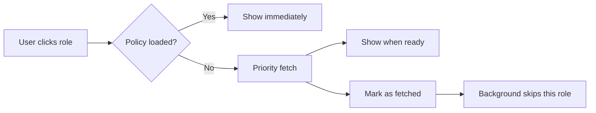
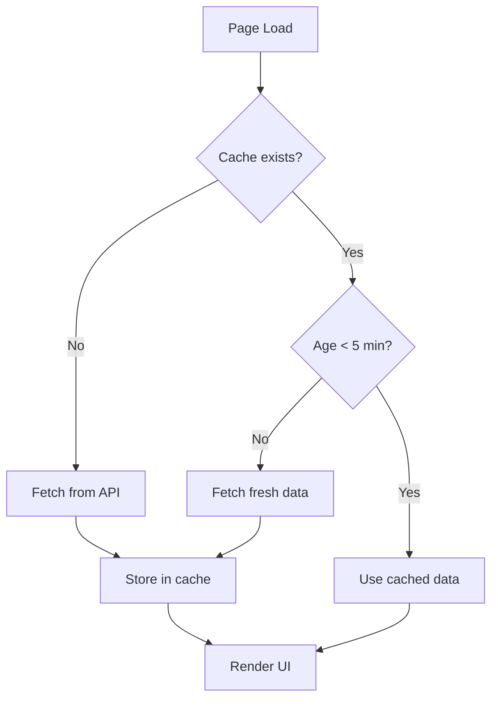

# Key Concepts

This document explains important technical concepts used in PIM Configurator. Understanding these helps you navigate the codebase and troubleshoot issues.

---

## Table of Contents

1. [Deferred Loading](#deferred-loading)
2. [Priority Fetch](#priority-fetch)
3. [Context Pattern](#context-pattern)
4. [Caching Strategy](#caching-strategy)
5. [Concurrent Workers](#concurrent-workers)
6. [Policy vs Assignment](#policy-vs-assignment)
7. [Unified Context & Workloads](#unified-context--workloads)
8. [Consent Framework](#consent-framework)

---

## Deferred Loading

**What it is**: Loading non-critical data in the background after the UI is already visible.

**Why we use it**: PIM policies take ~2 minutes to fetch for all roles. Users shouldn't wait that long to see basic information.

```
┌─────────────────────────────────────────────────────────┐
│ Traditional Approach                                     │
│                                                         │
│ [Fetch all data] ─────────────────────────> [Show UI]   │
│        └── 2+ minutes waiting ──┘                       │
└─────────────────────────────────────────────────────────┘

┌─────────────────────────────────────────────────────────┐
│ Deferred Loading (Our Approach)                          │
│                                                         │
│ [Fetch basic data] ───> [Show UI] ───> [Background...]  │
│        └── 10-15s ──┘      └── Work while loading! ──┘  │
└─────────────────────────────────────────────────────────┘
```

> [!TIP]
> The UI shows "Fetching role configuration in background... (15/130)" to indicate background loading progress.

---

## Priority Fetch

**What it is**: Immediately fetching data for a specific item when the user interacts with it, bypassing the normal queue.

**When it happens**: When you click on a role card before its policy has been loaded in the background.

**How it works**:
1. User clicks role → check if policy exists
2. If not → fetch immediately (priority)
3. Mark as fetched → background loader skips it later



> [!NOTE]
> Priority fetch ensures the role you're interested in loads first, regardless of its position in the queue.

---

## Context Pattern

**What it is**: A React pattern for sharing state across multiple components without "prop drilling".

**In PIM Configurator**: `PimDataContext` provides shared access to:
- Role data
- Loading states
- Fetch functions
- Fetch functions
- (Planned) Write operations

**Without Context**:
```
App
 └── Dashboard (passes data down)
      └── RoleList (passes data down)
           └── RoleCard (finally uses data)
```

**With Context**:
```
App
 └── PimDataProvider (provides data to all)
      ├── Dashboard (uses context directly)
      ├── Report (uses context directly)
      └── Configure (uses context directly)
```

**How to use**:
```typescript
// In any component
const { rolesData, loading, fetchPolicyForRole } = usePimData();
```

---

## Caching Strategy

**What it is**: Storing fetched data temporarily to avoid re-fetching on every page navigation.

### Session Storage Cache

| Aspect | Implementation |
|--------|----------------|
| Storage location | Browser's session storage |
| Lifetime | Until browser tab closes |
| Freshness check | Data older than 5 minutes is re-fetched |
| Size | ~5-10 MB for typical tenant |

### Cache Flow



> [!WARNING]
> Session storage is cleared when you close the browser tab. Data is not persisted between sessions.

---

## Concurrent Workers

**What it is**: Multiple parallel processes fetching data simultaneously, with controlled rate limiting.

**Why we use it**: Fetching 130 policies sequentially would take ~5 minutes. With 3 workers, it takes ~2 minutes.

### Worker Pool Pattern

```
┌─────────────────────────────────────────────────────────┐
│                    Role Queue                           │
│  [Role 1][Role 2][Role 3][Role 4][Role 5][Role 6]...    │
└─────────────────────────────────────────────────────────┘
         │         │         │
         ▼         ▼         ▼
    ┌─────────┬─────────┬─────────┐
    │Worker 1 │Worker 2 │Worker 3 │
    │ Role 1  │ Role 2  │ Role 3  │
    │ Role 4  │ Role 5  │ Role 6  │
    │  ...    │  ...    │  ...    │
    └─────────┴─────────┴─────────┘
         │         │         │
         └────────┬┴─────────┘
                  ▼
           ┌──────────────┐
           │ Policy Map   │
           │ (Results)    │
           └──────────────┘
```

### Configuration

| Setting | Value | Reason |
|---------|-------|--------|
| Workers | 8 (optimized) | Maximum parallel requests without throttling |
| Delay | 300ms (optimized) | Per-worker cooldown between requests |
| Total throughput | ~26 policies/second | 70-80% faster than original implementation |

> [!CAUTION]
> The worker pool is optimized for Microsoft Graph API rate limits. Changing these values may cause throttling (429 errors).

---

## Policy vs Assignment

Understanding the difference between these two concepts is crucial.

### Assignment

**What it is**: A connection between a user/group and a role.

**Types**:
| Type | Description | Needs Activation? |
|------|-------------|-------------------|
| Permanent | Direct role assignment | No |
| Eligible | Can activate role via PIM | Yes |
| Active | Currently activated PIM assignment | N/A (already active) |

### Policy

**What it is**: Configuration rules for how a role can be activated.

**Examples**:
- Maximum activation duration (e.g., 8 hours)
- Require MFA for activation
- Require approval before activation
- Who can approve

### Relationship

```
┌─────────────────────────────────────────┐
│                 Role                    │
│          (e.g., Global Admin)           │
├────────────────────┬────────────────────┤
│    Assignments     │      Policy        │
├────────────────────┼────────────────────┤
│ Alice (Permanent)  │ Max duration: 8h   │
│ Bob (Eligible)     │ Require MFA: Yes   │
│ Carol (Active)     │ Require approval:  │
│                    │   → Security Team  │
└────────────────────┴────────────────────┘
```

> [!IMPORTANT]
> Assignments define **who** can use a role. Policies define **how** they can use it.

---

## Unified Context & Workloads

**What it is**: An architecture that combines multiple data sources ("workloads") into a single central state manager.

**Workloads**:
- **Directory Roles**: Standard Microsoft Entra ID roles.
- **PIM for Groups**: PIM settings for M365 groups.
- **Security Alerts**: Security recommendations.

**UnifiedPimContext**:
This context manages data from all workloads and ensures components (like the Export function) can access *all* data via a single hook: `useUnifiedPimData()`.

---

## Consent Framework

**What it is**: A mechanism to request permissions step-by-step ("Incremental Consent").

**How it works**:
1. The app starts with minimal read permissions (for Directory Roles).
2. If you enable an optional workload (e.g., "PIM for Groups"), the app requests the extra required permissions via a popup.
3. If you decline, the rest of the app continues to work; only that specific feature remains disabled.

> [!TIP]
> This ensures users are not overwhelmed with consent requests for features they might not use immediately upon login.

---

## Next Steps

- [Report Page](./07-report-page.md) - Feature documentation
- [Configure Page](./08-configure-page.md) - Configuration features
