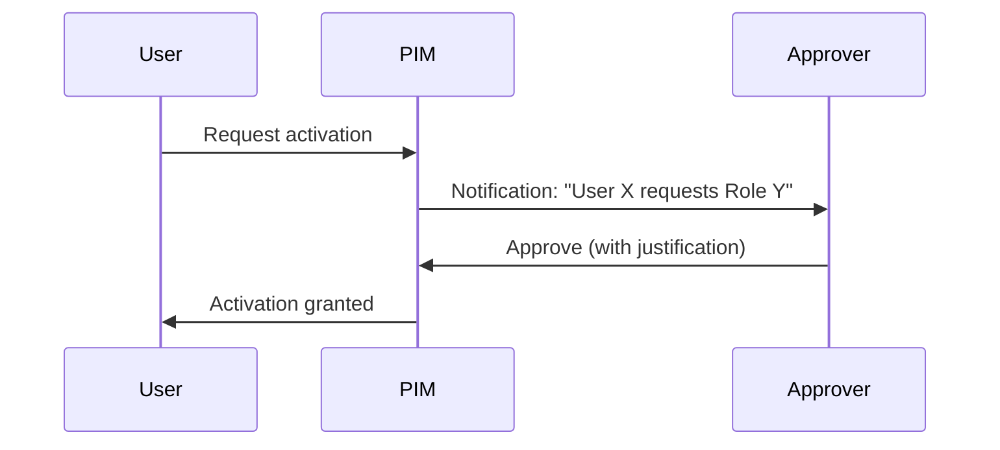

# Configure Page

This document explains the features and functionality of the Configure page, where you can bulk-modify PIM settings.

---

## Overview

> [!IMPORTANT]
> **Status: In Development**
> The Configure page is not yet available in the application. This functionality is on the roadmap for a future release. The documentation below describes the planned functionality.

The Configure page will allow you to:
- Select multiple roles
- Apply consistent PIM settings
- Create role assignments

```
┌─────────────────────────────────────────────────────────┐
│                   Configure Page                        │
├───────────────────────┬─────────────────────────────────┤
│    Role Selection     │    Configuration Form           │
├───────────────────────┼─────────────────────────────────┤
│ ☐ Global Admin        │  ┌─────────────────────────┐   │
│ ☑ User Admin          │  │ Activation Settings     │   │
│ ☑ Groups Admin        │  │ ─────────────────────── │   │
│ ☐ Exchange Admin      │  │ Max Duration: [4 hours] │   │
│ ☑ SharePoint Admin    │  │ ☑ Require MFA          │   │
│ ...                   │  │ ☑ Require Justification│   │
│                       │  │ ☐ Require Approval     │   │
│ 3 roles selected      │  └─────────────────────────┘   │
│                       │                                 │
│                       │  [Apply Settings]               │
│                       │  [Create Assignments]           │
└───────────────────────┴─────────────────────────────────┘
```

---

## Features

### Role Selection

The left panel shows all available roles.

**Features**:
- Search to filter roles
- Click to select/deselect
- Shows assignment counts
- Tags indicate role type

> [!TIP]
> Select roles with similar purposes (e.g., all Exchange-related roles) to apply consistent settings.

---

### Configuration Form

The right panel shows configuration options when roles are selected.

#### Load From Selected Role

If exactly one role is selected:
- Loads that role's current settings
- Pre-fills the form
- Useful as a template

---

## Activation Settings

Settings that apply when users **activate** their eligible role.

| Setting | Description | Recommended |
|---------|-------------|-------------|
| **Max Duration** | Maximum activation time | 4-8 hours for most roles |
| **Require MFA** | Users must complete MFA | ✅ Always enable |
| **Require Justification** | Users must explain why | ✅ Enable for audit |
| **Require Ticket Info** | Link to ticket system | Optional |
| **Require Approval** | Must be approved first | For sensitive roles |
| **Approvers** | Who can approve | Security team or managers |

### Max Duration Options

| Duration | Use Case |
|----------|----------|
| 1 hour | Highly sensitive, short tasks |
| 4 hours | Standard workday support |
| 8 hours | Full workday coverage |
| 12+ hours | On-call or extended operations |

> [!WARNING]
> Longer durations increase risk. Users remain privileged for the entire duration.

---

## Assignment Settings

Settings that apply to eligible/active **assignments**.

| Setting | Description |
|---------|-------------|
| **Allow Permanent Eligible** | Eligible assignments never expire |
| **Max Eligible Duration** | If not permanent, how long |
| **Allow Permanent Active** | Active assignments never expire |
| **Max Active Duration** | If not permanent, how long |

> [!CAUTION]
> Permanent active assignments bypass PIM entirely. Avoid unless absolutely necessary.

---

## Approval Configuration

When "Require Approval" is enabled:

### Approver Selection

You can select:
- **Users**: Individual approvers
- **Groups**: All group members can approve

### Approval Flow



> [!TIP]
> Use groups for approvers to ensure coverage when individuals are unavailable.

---

## Apply Settings

Click "Apply Settings" to update the selected roles.

### What Happens

1. **Validation**: Form inputs are validated
2. **Confirmation**: Review what will change
3. **Processing**: Each role is updated sequentially
4. **Verification**: Settings are verified after applying
5. **Results**: Success/failure shown for each role

### Progress Modal

```
┌──────────────────────────────────────────┐
│        Applying Configuration            │
├──────────────────────────────────────────┤
│ ✅ Applying PIM Settings                 │
│    Applied to 3 roles. Failed: 0         │
│                                          │
│ ⏳ Verifying Configuration               │
│    Verifying applied settings...         │
└──────────────────────────────────────────┘
```

> [!NOTE]
> Verification ensures settings were actually applied. Graph API can sometimes silently fail.

---

## Create Assignments

Click "Create Assignments" to add users/groups to the selected roles.

### Assignment Form

| Field | Description |
|-------|-------------|
| **Type** | Eligible or Active |
| **Principals** | Users or groups to assign |
| **Duration** | How long the assignment lasts |
| **Justification** | Why the assignment is being made |

### Bulk Creation

Assignments are created for:
- Each selected role × Each selected principal

Example: 3 roles × 2 users = 6 assignment requests

---

## Permissions Required

> [!IMPORTANT]
> The Configure page requires the `RoleManagement.ReadWrite.Directory` permission.

Without this permission:
- Settings form will work but apply will fail
- Error message will indicate missing permissions

> [!NOTE]
> Since this feature is not yet active, these write permissions are currently **not required** to use PIM Manager.

---

## Best Practices

### Standardize Settings

1. Define organization-wide standards
2. Select all similar roles
3. Apply consistent settings

Example standards:
- All privileged roles: 4h max, MFA required, approval required
- All standard roles: 8h max, MFA required

### Test First

1. Select one non-critical role
2. Apply settings
3. Verify in Azure Portal
4. Then apply to other roles

### Document Changes

1. Export current settings (Report page)
2. Make changes
3. Export new settings
4. Compare for audit trail

---

## Troubleshooting

### "Failed to apply settings"

**Cause**: Permission issues or API errors

**Solution**:
1. Verify you have `RoleManagement.ReadWrite.Directory`
2. Check if role is protected (e.g., Global Admin requires Global Admin)
3. Check browser console for detailed error

### Verification failed

**Cause**: Settings didn't propagate yet

**Solution**:
1. Wait 30 seconds
2. Check manually in Azure Portal
3. Settings may still have applied despite verification failure

### Assignment creation failed

**Cause**: User already has assignment, or validation error

**Solution**:
1. Check if user is already assigned
2. Verify user/group exists
3. Check justification meets requirements

---

## Next Steps

- [Report Page](./06-report-page.md) - View your configurations
- [Key Concepts](./05-key-concepts.md) - Understand terminology
