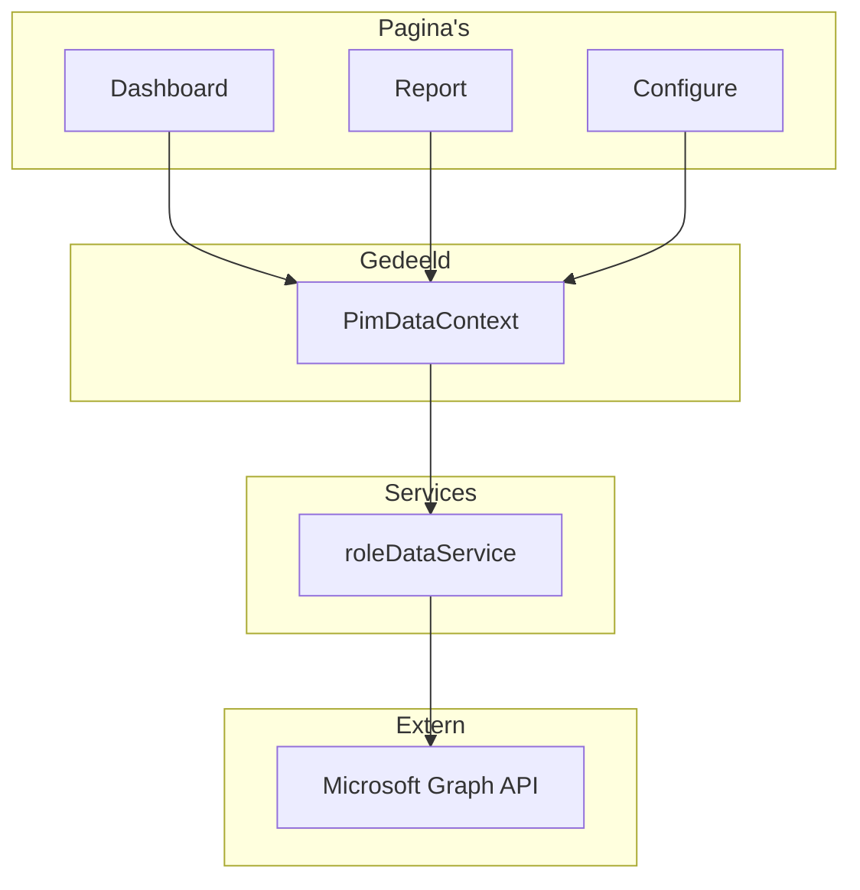

# Mappenstructuur

Dit document legt de organisatie van de PIM Configurator codebase uit. Het begrijpen van deze structuur helpt je navigeren door de code en specifieke functionaliteit te vinden.

---

## Hoofdmap

```
PIM-configurator/
├── docs/                  # Documentatie (je bent hier)
├── public/                # Statische bestanden (iconen, afbeeldingen)
├── src/                   # Broncode (hoofdapplicatie)
├── package.json           # Dependencies en scripts
├── DEPLOYMENT.md          # Deployment instructies
└── README.md              # Project overzicht
```

---

## Broncode (`/src`)

De `/src` map bevat alle applicatiecode, georganiseerd op doel:

```
src/
├── app/                   # Pagina's (Next.js App Router)
├── components/            # Herbruikbare UI-componenten
├── contexts/              # React Context providers
├── services/              # Data-ophaal logica
├── types/                 # TypeScript type definities
├── utils/                 # Hulpfuncties
├── config/                # Configuratie constanten
└── hooks/                 # Custom React hooks
```

---

## Gedetailleerd Overzicht

### 📁 `src/app/` - Pagina's

Elke submap vertegenwoordigt een pagina in de applicatie.

| Map | Doel |
|-----|------|
| `app/page.tsx` | Landingspagina (login) |
| `app/dashboard/` | Dashboard overzicht |
| `app/report/` | Hoofdrapportpagina met alle roldata |
| `app/configure/` | (Binnenkort) Bulk configuratiepagina |
| `app/layout.tsx` | Gedeelde layout (navigatie, providers) |
| `app/globals.css` | Globale stijlen |

> [!NOTE]
> Next.js gebruikt **bestandsgebaseerde routing**. De mappenstructuur komt direct overeen met URLs:
> - `/app/report/page.tsx` → `https://jouwapp.com/report`

---

### 📁 `src/components/` - UI Componenten

Herbruikbare bouwstenen die op meerdere pagina's worden gebruikt.

| Component | Doel |
|-----------|------|
| `Sidebar.tsx` | Zijnavigatiebalk |
| `HelpModal.tsx` | Help documentatie overlay |
| `LoadingStatus.tsx` | Inline laadindicator voor achtergrond policy-ophalen |
| `ScopeBadge.tsx` | Badge die toewijzingsscope toont (Tenant-breed, App, RMAU) |
| `RoleFilters.tsx` | Filter UI-component voor Rapportpagina |
| `RoleList.tsx` | Lijst van selecteerbare rollen (gebruikt in Configure) |
| `RoleSettingsForm.tsx` | Formulier voor PIM-instellingen |
| `ProgressModal.tsx` | Voortgangsindicator voor bulk-operaties |

---

### 📁 `src/contexts/` - Gedeelde State

React Context voor het delen van state over meerdere componenten.

| Bestand | Doel |
|---------|------|
| `PimDataContext.tsx` | **Centrale data-opslag** voor alle PIM-data |

> [!IMPORTANT]
> `PimDataContext` is het hart van het delen van data. Het:
> - Haalt data één keer op
> - Cacht het in session storage
> - Stelt het beschikbaar aan alle pagina's
> - Handelt achtergrond policy-loading af

---

### 📁 `src/services/` - Data Ophalen

Kernlogica voor interactie met Microsoft Graph API.

| Bestand | Doel |
|---------|------|
| `roleDataService.ts` | **Alle data-ophaal logica** |

Dit bestand bevat:
- `getRoleDefinitions()` - Ophalen van roldefinities
- `fetchSinglePolicy()` - Ophalen van één rol's PIM-beleid
- `concurrentFetchPolicies()` - Achtergrond policy-ophalen
- `getAllRolesOptimizedWithDeferredPolicies()` - Hoofdfunctie voor data-laden

> [!WARNING]
> **Throttling Bescherming**: Dit bestand bevat vertragingen en gelijktijdigheidslimieten om Microsoft Graph API throttling te voorkomen. Verwijder deze beveiligingen niet.

---

### 📁 `src/types/` - Type Definities

TypeScript interfaces die datastructuren beschrijven.

| Bestand | Doel |
|---------|------|
| `roleData.ts` | Alle PIM-gerelateerde types |
| `index.ts` | Exports voor makkelijk importeren |

Belangrijke types:
- `RoleDefinition` - Een Azure AD rol
- `RoleAssignment` - Een permanente toewijzing
- `PimEligibilitySchedule` - Een eligible toewijzing
- `PimPolicy` - PIM-configuratie voor een rol
- `RoleDetailData` - Gecombineerde data voor één rol

---

### 📁 `src/utils/` - Hulpfuncties

Utility functies en API helpers.

| Bestand | Doel |
|---------|------|
| `pimApi.ts` | (Gepland) API-functies voor toekomstige Configuratiepagina |
| `scopeUtils.ts` | Scope-detectie en weergave utilities (Tenant-breed, App-scoped, RMAU) |
| `authContextApi.ts` | Authentication Context Class Reference API |

---

### 📁 `src/config/` - Configuratie

Applicatie configuratie constanten.

| Bestand | Doel |
|---------|------|
| `authConfig.ts` | Azure AD authenticatie configuratie |
| `constants.ts` | Applicatie-brede constanten |
| `pdfExportConfig.ts` | **PDF Export configuratie** - single source of truth voor export secties en statistieken |

> [!TIP]
> Om een nieuwe statistiek toe te voegen aan de PDF export, voeg simpelweg een entry toe aan de `OVERVIEW_STATS` array in `pdfExportConfig.ts`. Het verschijnt automatisch in de export modal en PDF.

> [!CAUTION]
> Het `authConfig.ts` bestand bevat je **Azure AD client ID**. Zorg ervoor dat dit overeenkomt met je app-registratie.

---

### 📁 `src/hooks/` - Custom Hooks

Herbruikbare React hooks.

| Bestand | Doel |
|---------|------|
| `usePimData.ts` | **Hoofd data hook** - biedt toegang tot PimDataContext |
| `useRoleFilters.ts` | Filter state management voor de Rapportpagina |
| `useRoleSettings.ts` | Hook voor het beheren van rolinstellingen state |

---

## Bestandsrelaties



---

## Volgende Stappen

- [Dataflow](./03-dataflow.md) - Zie hoe data door deze bestanden stroomt
- [Graph API Calls](./04-graph-api-calls.md) - Leer welke APIs worden aangeroepen
