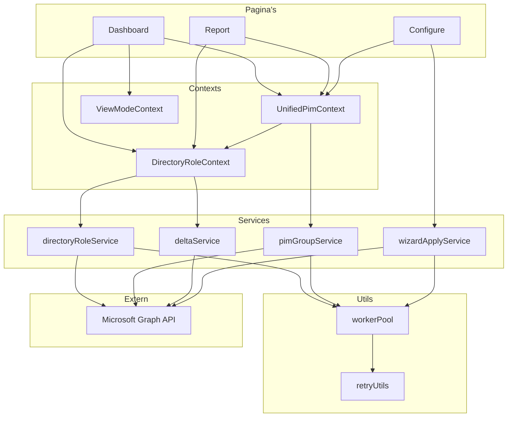

# Mappenstructuur

Dit document legt de organisatie van de PIM Manager codebase uit. Het begrijpen van deze structuur helpt je navigeren door de code en specifieke functionaliteit te vinden.

---

## Hoofdmap

```
PIM-manager/
├── docs/                  # Documentatie (je bent hier)
├── public/                # Statische bestanden (iconen, afbeeldingen)
├── src/                   # Broncode (hoofdapplicatie)
├── package.json           # Dependencies en scripts
└── README.md              # Project overzicht
```

---

## Broncode (`/src`)

De `/src` map bevat alle applicatiecode, georganiseerd op doel:

```
src/
├── app/                   # Pagina's (Next.js App Router)
├── components/            # Herbruikbare UI-componenten
├── contexts/              # React Context providers
├── services/              # Data-ophaal logica
├── types/                 # TypeScript type definities
├── utils/                 # Hulpfuncties
├── config/                # Configuratie constanten
└── hooks/                 # Custom React hooks
```

---

## Gedetailleerd Overzicht

### 📁 `src/app/` - Pagina's

Elke submap vertegenwoordigt een pagina in de applicatie.

| Map | Doel |
|-----|------|
| `app/page.tsx` | Landingspagina (login) |
| `app/dashboard/` | Dashboard overzicht |
| `app/report/` | Hoofdrapportpagina met alle roldata |
| `app/configure/` | PIM configuratiepagina (Wizard, Handmatig, Bulk modi) |
| `app/layout.tsx` | Gedeelde layout (navigatie, providers) |
| `app/globals.css` | Globale stijlen |

> [!NOTE]
> Next.js gebruikt **bestandsgebaseerde routing**. De mappenstructuur komt direct overeen met URLs:
> - `/app/report/page.tsx` → `https://jouwapp.com/report`

---

### 📁 `src/components/` - UI Componenten

Herbruikbare bouwstenen die op meerdere pagina's worden gebruikt.

| Component | Doel |
|-----------|------|
| `configure/` | Configure functie (Wizard, Handmatig, Bulk modi) |
| `configure/shared/PrincipalSelector.tsx` | Gebruiker/groep zoeken via Graph API (gedeeld over modi) |
| `ui/` | Primitieve UI-componenten: Toggle, Skeleton, Toast, DurationSlider |
| `Sidebar.tsx` | Zijnavigatiebalk |
| `HelpModal.tsx` | Help documentatie overlay |
| `LoadingStatus.tsx` | Inline laadindicator voor achtergrond policy-ophalen |
| `ScopeBadge.tsx` | Badge die toewijzingsscope toont (Tenant-breed, App, RMAU) |
| `RoleSettingsForm.tsx` | Formulier voor PIM-instellingen |
| `ProgressModal.tsx` | Voortgangsindicator voor bulk-operaties |

---

### 📁 `src/contexts/` - React Context Providers

Globale state management met React Context API.

| Bestand | Doel |
|---------|------|
| `UnifiedPimContext.tsx` | **Hoofd Orchestrator**: Beheert alle workloads (Directory Roles, PIM Groups, etc.) met unified refresh logica |
| `DirectoryRoleContext.tsx` | **Directory Roles State**: Beheert rol data, policies, toewijzingen met delta sync. Exporteert `PimDataProvider` voor achterwaartse compatibiliteit. |
| `ViewModeContext.tsx` | **UI Voorkeuren**: Beheert Basic/Advanced view mode toggle met localStorage persistentie |
| `MobileMenuContext.tsx` | **Mobile UI State**: Controleert mobile menu open/close state |
| `ToastContext.tsx` | **Notificaties**: Toast notificatiesysteem (succes/fout/info, automatisch sluiten na 3s) |

**Belangrijke Context Relaties:**
- `UnifiedPimContext` orkestreert meerdere workloads
- `DirectoryRoleContext` levert directory rol-specifieke data
- Dashboard en Report pagina's consumeren beide contexts
- Delta sync gebeurt transparant door contexts

---

### 📁 `src/services/` - Data Ophalen

Kernlogica voor interactie met Microsoft Graph API.

| Bestand | Doel |
|---------|------|
| `directoryRoleService.ts` | **Directory Roles**: Ophalen van roldefinities, toewijzingen, policies |
| `pimGroupService.ts` | **PIM Groups**: Ophalen van PIM-onboarded groepen en policies |
| `pimConfigurationService.ts` | **Policy Lezen/Schrijven**: Verwerk regels, update PIM policies en toewijzingen |
| `wizardApplyService.ts` | **Wizard Toepassen**: Voer bulk policy/toewijzing schrijven uit via Graph API |
| `deltaService.ts` | **Slimme Verversing**: Delta queries voor incrementele updates |
| `CsvParserService.ts` | **Bulk Modus**: Parsen en valideren van CSV-bestanden voor batchconfiguratie |
| `WizardValidationService.ts` | **Wizard Validatie**: Cross-stap bedrijfsregel validatie |
| `policyParserService.ts` | **Policy Parsing**: Parse Graph API policy regelstructuren naar getypede instellingen |

**directoryRoleService.ts** bevat:
- `getRoleDefinitions()` - Ophalen van roldefinities
- `fetchSinglePolicy()` - Ophalen van één rol's PIM-beleid
- `concurrentFetchPolicies()` - Achtergrond policy-ophalen
- `getAllRolesOptimizedWithDeferredPolicies()` - Hoofdfunctie voor data-laden

**pimGroupService.ts** bevat:
- `fetchAllPimGroupData()` - Ophalen van alle PIM Groups data
- `fetchSingleGroupPolicy()` - Ophalen van beleid voor één groep
- `concurrentFetchGroupPolicies()` - Parallelle groepsbeleid ophalen
- `syncGroupsWithDelta()` - Delta sync voor groepen

**deltaService.ts** bevat:
- `fetchDirectoryRoleDeltas()` - Incrementele updates voor rollen
- `fetchGroupDeltas()` - Incrementele updates voor groepen
- `getStoredDeltaLink()` / `clearDeltaLink()` - Delta token beheer

> [!WARNING]
> **Throttling Bescherming**: Services gebruiken worker pools en vertragingen om Graph API throttling (429 fouten) te voorkomen. Verwijder deze beveiligingen niet.

---

### 📁 `src/types/` - Type Definities

TypeScript interfaces die datastructuren beschrijven.

| Bestand | Doel |
|---------|------|
| `directoryRole.types.ts` | Directory Roles types (RoleDefinition, PimPolicy, etc.) |
| `pimGroup.types.ts` | PIM Groups types (PimGroup, GroupPolicy, etc.) |
| `wizard.types.ts` | Wizard data types (WizardData, WorkloadConfig, etc.) |
| `workload.ts` | Workload systeem types (WorkloadType, WorkloadData) |
| `roleFilters.ts` | Filter types voor rol/groep filteren |
| `securityAlerts.ts` | Security alert types |
| `index.ts` | Centrale exports voor makkelijk importeren |

**Belangrijke types (directoryRole.types.ts):**
- `RoleDefinition` - Een Microsoft Entra ID rol
- `RoleAssignment` - Een permanente toewijzing
- `PimEligibilitySchedule` - Een eligible toewijzing
- `PimPolicy` - PIM-configuratie voor een rol
- `RoleDetailData` - Gecombineerde data voor één rol

---

### 📁 `src/utils/` - Hulpfuncties

Utility functies en API helpers.

| Bestand | Doel |
|---------|------|
| `workerPool.ts` | **Worker Pool**: Parallelle API-calls met gelijktijdigheidscontrole en throttling bescherming (standaard: 8 workers, 300ms) |
| `retryUtils.ts` | **Retry Logica**: `withRetry()` met exponentiële backoff voor 429/5xx fouten |
| `durationUtils.ts` | **Duration Helpers**: ISO 8601 parsing, formattering en Graph API duration conversies |
| `etagCache.ts` | **ETag Cache**: ETag-gebaseerde HTTP caching om overbodige API-calls te vermijden |
| `scopeUtils.ts` | **Scope Detectie**: Identificeer scope types (Tenant-breed, App-scoped, AU, RMAU, etc.) |
| `logger.ts` | **Gecentraliseerde Logging**: Gestructureerde logging met dynamisch niveau via localStorage |
| `authContextApi.ts` | **Authenticatie Contexten**: Haal Conditional Access authenticatie contexten op |
| `alertFormatting.ts` | **Alert Formattering**: Formatteer en sorteer security alerts op ernst |
| `chartCapture.ts` | **PDF Generatie**: Capture chart elementen als afbeeldingen voor PDF export |

---

### 📁 `src/config/` - Configuratie

Applicatie configuratie constanten.

| Bestand | Doel |
|---------|------|
| `authConfig.ts` | Microsoft Entra ID authenticatie configuratie |
| `constants.ts` | Applicatie-brede constanten |
| `pdfExportConfig.ts` | **PDF Export configuratie** - single source of truth voor export secties en statistieken |
| `locales/en.ts` | **Externe Tekst** - Gecentraliseerde UI-strings (Help, Instellingen, etc.) |

> [!TIP]
> Om een nieuwe statistiek toe te voegen aan de PDF export, voeg simpelweg een entry toe aan de `OVERVIEW_STATS` array in `pdfExportConfig.ts`. Het verschijnt automatisch in de export modal en PDF.

> [!CAUTION]
> Het `authConfig.ts` bestand bevat je **Microsoft Entra ID client ID**. Zorg ervoor dat dit overeenkomt met je app-registratie.

---

### 📁 `src/hooks/` - Custom Hooks

Herbruikbare React hooks.

| Bestand | Doel |
|---------|------|
| `useWizardState.tsx` | **Wizard State**: Volledige wizard context + selector hooks (useWizardData, useWizardActions, etc.) |
| `usePimData.ts` | **Directory Roles Data**: Toegang tot roldata, policies, ververs-functies |
| `usePimSelectors.ts` | **Gememoïseerde Selectors**: Geoptimaliseerde selectors om onnodige re-renders te voorkomen |
| `useAggregatedData.ts` | **Data Aggregatie**: Combineert data over meerdere workloads (Directory Roles, PIM Groups) |
| `useRoleFilters.ts` | **Filter Beheer**: Rol/groep filter logica voor Report en Dashboard pagina's |
| `useConsentedWorkloads.ts` | **Workload Machtigingen**: Beheert welke workloads gebruikersconsent hebben |
| `useIncrementalConsent.ts` | **Consent Flow**: Verwerkt incrementele toestemmingsverzoeken |
| `useNavigationGuard.ts` | **Navigatie Guard**: Waarschuwt bij onopgeslagen wijzigingen bij wegnavigeren |

---

## Bestandsrelaties


```mermaid
flowchart TD
    subgraph "Pagina's"
        A[Dashboard]
        B[Report]
        C[Configure]
    end

    subgraph "Contexts"
        D[UnifiedPimContext]
        E[DirectoryRoleContext]
        F[ViewModeContext]
    end

    subgraph "Services"
        G[directoryRoleService]
        H[pimGroupService]
        I[deltaService]
        J[wizardApplyService]
    end

    subgraph "Utils"
        K[workerPool]
        L[retryUtils]
    end

    subgraph "Extern"
        M[Microsoft Graph API]
    end

    A --> D
    A --> E
    A --> F
    B --> D
    B --> E
    C --> D
    C --> J
    D --> E
    D --> H
    E --> G
    E --> I
    G --> K
    G --> M
    H --> K
    H --> M
    I --> M
    J --> K
    J --> M
    K --> L
```

---

## Volgende Stappen

- [Dataflow](./03-dataflow.md) - Zie hoe data door deze bestanden stroomt
- [Graph API Calls](./04-graph-api-calls.md) - Leer welke APIs worden aangeroepen
