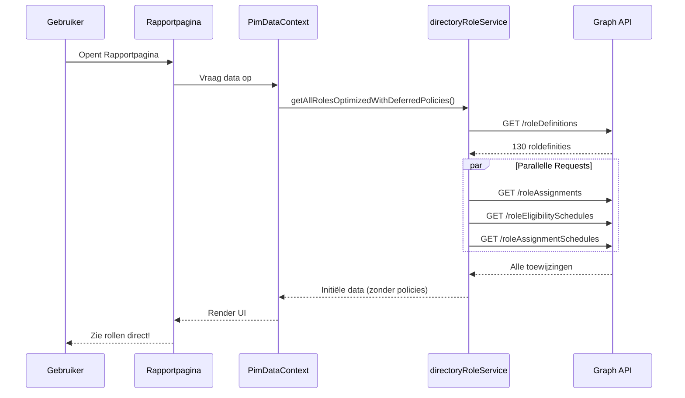
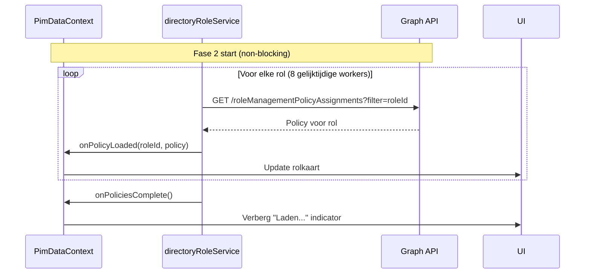
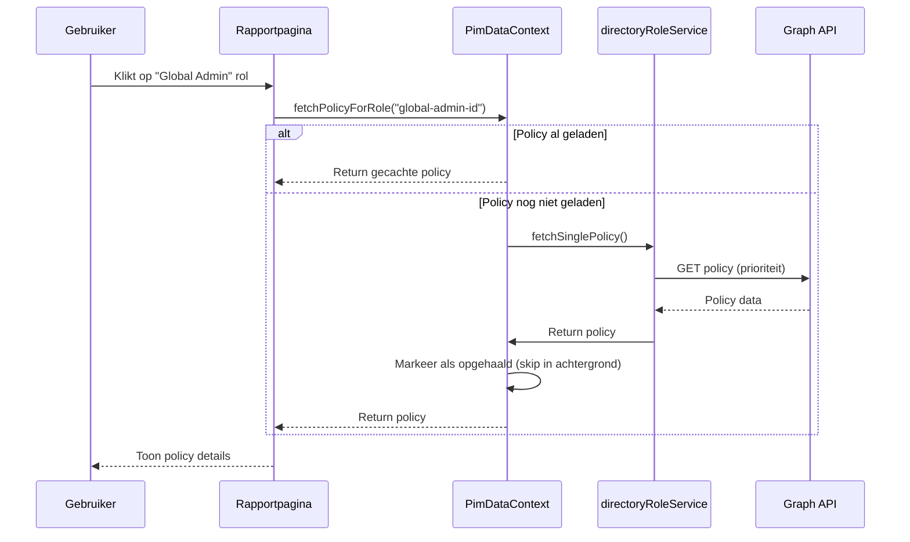
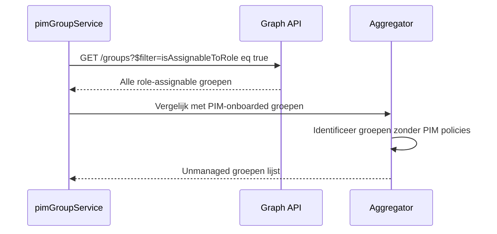
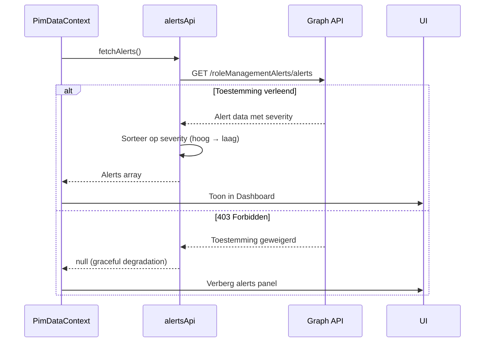
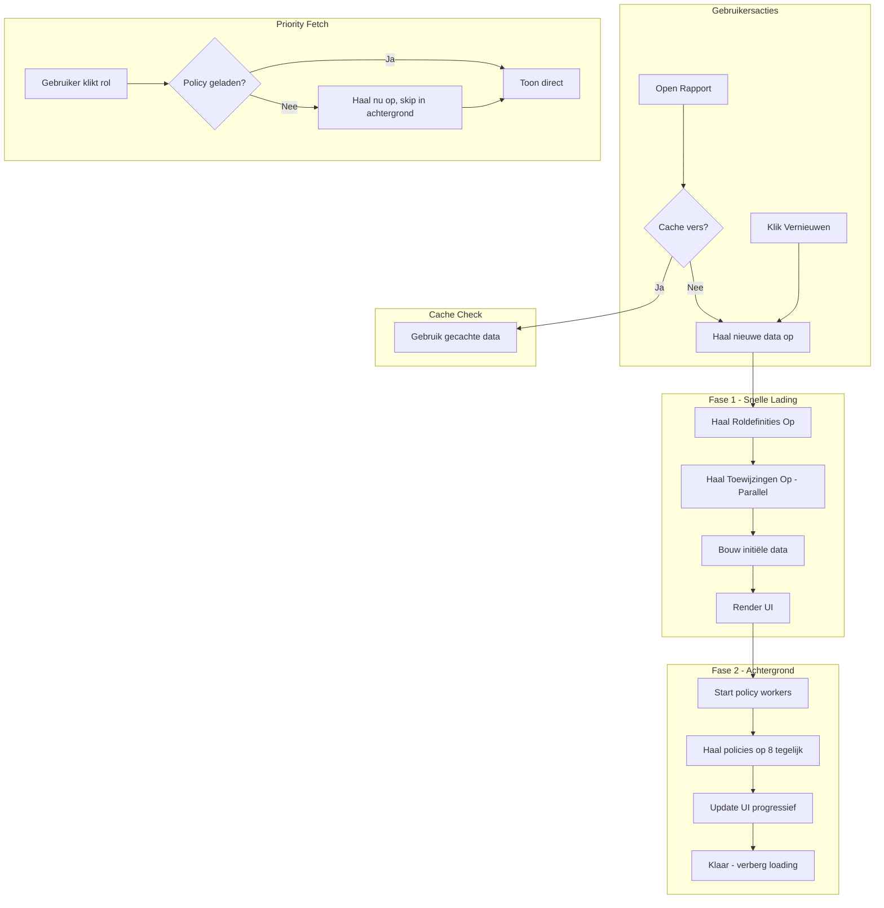

# Dataflow

Dit document legt uit hoe PIM Manager data ophaalt en verwerkt. Het begrijpen van deze flow helpt je problemen op te lossen en prestatie-eigenschappen te begrijpen.

---

## Overzicht

Data laden gebeurt in **twee fasen** om een snelle gebruikerservaring te bieden:

| Fase       | Wat Laadt                    | Duur            | Gebruikerservaring   |
| ---------- | ---------------------------- | --------------- | -------------------- |
| **Fase 1** | Roldefinities + toewijzingen | ~10-15 seconden | UI toont direct      |
| **Fase 2** | PIM-configuraties (policies) | ~2-3 minuten    | Laadt op achtergrond |

> [!TIP]
> De twee-fasen aanpak betekent dat gebruikers bijna direct kunnen beginnen met de data, terwijl gedetailleerde PIM-configuraties op de achtergrond blijven laden.

---

## Fase 1: Snelle Initiële Lading



### Wat Wordt Opgehaald

1. **Roldefinities** (sequentieel, eerst vereist)
   - Alle Microsoft Entra ID rollen (ingebouwd + custom)
   - ~130 rollen in een typische tenant

2. **Toewijzingen** (parallel, sneller)
   - Permanente roltoewijzingen
   - Eligible toewijzingen (PIM eligibility)
   - Actieve toewijzingen (momenteel geactiveerde PIM)

> [!NOTE]
> Parallel ophalen vermindert Fase 1 tijd met ~3x vergeleken met sequentiële requests.

---

## Fase 2: Achtergrond Policy Laden

Na Fase 1 laden policies **op de achtergrond** terwijl je werkt:



### Throttling Bescherming

> [!WARNING]
> Microsoft Graph API heeft rate limits. Het overschrijden ervan veroorzaakt `429 Too Many Requests` fouten.

Om throttling te voorkomen, gebruikt achtergrond laden:

| Beveiliging                    | Waarde                  | Doel                                           |
| ------------------------------ | ----------------------- | ---------------------------------------------- |
| **Gelijktijdige workers**      | 8 (geoptimaliseerd)     | Maximum parallelle requests                    |
| **Vertraging tussen requests** | 300ms (geoptimaliseerd) | Per-worker cooldown                            |
| **Retry logica**               | Ingebouwd               | Handelt tijdelijke fouten af                   |
| **Quota gebruik**              | 10-22%                  | Conservatief, veilig voor alle tenant groottes |

Dit resulteert in ~26 policies per seconde, voltooiend in **~3-5 seconden voor 50 rollen** (70-80% sneller dan de originele implementatie).

---

## Priority Fetch (Op Aanvraag)

Als je op een rol klikt **voordat** de policy is geladen, gebruikt de app **priority fetching**:



> [!TIP]
> Priority fetch zorgt ervoor dat de rol waarop je klikte direct laadt, zelfs als achtergrond laden het nog niet heeft bereikt.

> Priority fetch zorgt ervoor dat de rol waarop je klikte direct laadt, zelfs als achtergrond laden het nog niet heeft bereikt.

---

## PIM voor Groepen Strategie

Voor **PIM voor Groepen** wordt een andere, geoptimaliseerde strategie gebruikt omdat de standaard API's traag kunnen zijn voor groepen.

### 1. Discovery (Beta Endpoint)

We gebruiken eerst een speciaal endpoints om _alleen_ groepen te vinden die daadwerkelijk PIM aan hebben staan:

- **Endpoint**: `/beta/identityGovernance/privilegedAccess/group/resources`
- **Doel**: Voorkomt het scannen van duizenden groepen die geen PIM gebruiken.
- **Permission**: `PrivilegedAccess.Read.AzureADGroup`

### 2. Parallel Laden

Na discovery worden details parallel opgehaald (net als bij rollen):

```mermaid
graph LR
    A[Lijst PIM Groepen] --> B{Worker Pool (8x)}
    B --> C[Haal Details]
    B --> D[Haal Policies]
    B --> E[Haal Members]
```

### 3. Unmanaged Groups Detectie

Na het ophalen van PIM-onboarded groepen identificeert het systeem beveiligingslekken:



**Detectielogica:**

- Haal alle groepen op met `isAssignableToRole: true`
- Vergelijk met PIM-onboarded groepen uit Fase 1
- Groepen met toewijzingscapaciteit maar zonder PIM-beleid = **Unmanaged**
- **Worker Pool**: 5 workers, 200ms vertraging
- **Doel**: Identificeer privilege escalatierisico's

**Beveiligingsimpact:**
Unmanaged groepen kunnen geprivilegieerde rollen toewijzen zonder PIM-controles:

- Geen tijdgebonden activaties
- Geen MFA-vereisten
- Geen goedkeuringsworkflows
- Geen audittrail

---

## Security Alerts Data Flow

Security Alerts worden apart opgehaald als een optionele feature:



### Ophaaltrategie

- **Endpoint**: `/identityGovernance/roleManagementAlerts/alerts`
- **Filter**: `scopeId eq '/' and scopeType eq 'DirectoryRole'`
- **Permission**: `RoleManagementAlert.Read.Directory` (optioneel)
- **Timing**: Opgehaald met Directory Roles data
- **API Version**: beta

### Graceful Degradation

- **403 Forbidden** → Feature verborgen in UI
- Geen foutmelding getoond aan gebruiker
- App blijft normaal werken zonder alerts
- Optioneel permissiemodel

### Weergave

- Gesorteerd op severity: **High** → **Medium** → **Low** → **Informational**
- Getoond in Dashboard Security Alerts panel
- Elke alert toont:
  - Severity level met kleurcodering
  - Alert beschrijving
  - Aantal incidenten
  - Beïnvloede rollen/principals

---

## Datatransformatie (De "Aggregator")

Zodra data is opgehaald uit de Graph API, is het niet direct klaar voor de grafieken en kaarten op het dashboard. Het gaat eerst door de **Aggregator Service**.

### Van JSON naar Inzichten

De Graph API retourneert ruwe JSON-objecten voor roltoewijzingen, eligibility-schema's en groepslidmaatschappen. De Aggregator-logica (voornamelijk in `useAggregatedData` en service-utilities):

1.  **Normaliseert** de verschillende objectstructuren naar een uniform formaat.
2.  **Analyseert** relaties (bijv. detecteren of een groep een PIM-beleid heeft).
3.  **Berekent** beveiligingsstatistieken zoals het aantal "Unmanaged Groups".

**Voorbeeld: Een Beveiligingslek Detecteren**
Een rauw Groep-object uit Graph ziet er zo uit:

```json
{
  "id": "group-id-123",
  "displayName": "Privileged Techs",
  "isRoleAssignable": true
}
```

De Aggregator controleert dit vervolgens tegen de PIM-policies. Als er geen policy overeenkomt met `group-id-123`, markeert de app dit als een **Unmanaged Group**. Zo wordt een simpele JSON-eigenschap getransformeerd naar een beveiligingsinzicht in je dashboard-grafieken.

### Verwerking in de Browser

Cruciaal is dat al deze logica **volledig in je browser** plaatsvindt. We sturen je tenant-data niet naar een backend voor verwerking. Jouw CPU doet het zware werk van het mappen van duizenden JSON-nodes naar het visuele rapport, waardoor je beveiligingsdata binnen je sessie blijft.

---

## Data Caching

Om het opnieuw ophalen van data bij elke pagina-navigatie te voorkomen:

### Session Storage Cache

| Sleutel              | Inhoud                  | Vervaldatum |
| -------------------- | ----------------------- | ----------- |
| `pim_data_cache`     | Geserialiseerde roldata | 60 minuten   |
| `pim_data_timestamp` | Laatste ophaal tijd     | -           |

Wanneer je navigeert tussen pagina's:

1. App controleert of gecachte data bestaat
2. Als cache vers is (< 60 minuten), gebruik het
3. Als cache verlopen is, haal nieuwe data op

### Vernieuwen Knop

De "Vernieuwen" knop op elke pagina:

- Roept `refreshAllWorkloads()` aan vanuit `UnifiedPimContext`
- Deze functie **delegeert** naar geregistreerde refresh handlers per workload
- Elke workload (DirectoryRoles, PIM Groups, etc.) registreert zijn refresh functie via `registerWorkloadRefresh`
- Gebruikt **Smart Refresh** (Delta Queries) indien mogelijk

> [!TIP]
> Dit modulaire ontwerp betekent dat elke nieuwe pagina simpelweg `refreshAllWorkloads()` kan aanroepen en alle workloads correct verversen, inclusief Smart Refresh logica voor Directory Roles.

### Slim Verversen (Smart Refresh)

Wanneer je op "Vernieuwen" klikt en er is een eerdere sync geweest:

1. App controleert op een **Delta Link** (opgeslagen token van vorige sync)
2. Vraagt alleen **wijzigingen** op sinds laatste keer (via `/directoryRoles/delta`)
3. Als er wijzigingen zijn:
   - Identificeert getroffen rollen
   - Update alleen die specifieke rollen in de lokale state
   - Haalt policies opnieuw op voor _alleen_ de gewijzigde rollen
4. Als Delta token verlopen is (410 Gone), valt automatisch terug op volledige verversing

**Voordeel:** Verversen duurt vaak < 1 seconde in plaats van 10+ seconden.

### Verzoek Annulering (AbortController)

Om race conditions en onnodig netwerkverkeer te voorkomen:

1. **Snel Klikken:** Meerdere keren op "Vernieuwen" klikken annuleert het vorige onvoltooide verzoek voordat een nieuwe start.
2. **Pagina Navigatie:** Het verlaten van een pagina annuleert automatisch alle lopende achtergrond fetches.
3. **Consistentie:** Dit geldt voor zowel Directory Roles als PIM Groups workloads.

> [!NOTE]
> Je kunt "Aborted" of "Cancelled" berichten zien in de console logs. Dit is verwacht gedrag en geeft aan dat het systeem oude requests netjes opruimt.

---

## Dataflow Diagram



---

## Prestatie Kenmerken

| Metriek            | Typische Waarde           | Opmerkingen                                     |
| ------------------ | ------------------------- | ----------------------------------------------- |
| Fase 1 tijd        | 10-15 seconden            | Afhankelijk van tenant grootte                  |
| Fase 2 tijd        | ~3-5 seconden (50 rollen) | Geoptimaliseerd met 8 workers, 300ms vertraging |
| Geheugengebruik    | ~5-10 MB                  | Gecacht in browser                              |
| API calls (Fase 1) | 4                         | Definities + 3 toewijzingstypes                 |
| API calls (Fase 2) | 130                       | Één per rol                                     |
| Doorvoer           | ~26 req/sec               | 70-80% sneller dan origineel                    |

---

## Probleemoplossing

### "Rolconfiguratie ophalen" blijft hangen

**Oorzaak**: API throttling of netwerkproblemen

**Oplossing**:

1. Wacht een paar minuten tot throttling verdwijnt
2. Klik Vernieuwen om opnieuw te starten
3. Controleer browserconsole op fouten

### Data lijkt verouderd

**Oorzaak**: Cache niet vernieuwd

**Oplossing**:

1. Klik de Vernieuwen knop
2. Of wacht 60 minuten voor automatische cache-vervaldatum

---

## Volgende Stappen

- [Graph API Calls](./04-graph-api-calls.md) - Gedetailleerde API referentie
- [Belangrijke Concepten](./05-belangrijke-concepten.md) - Technische concepten uitgelegd
